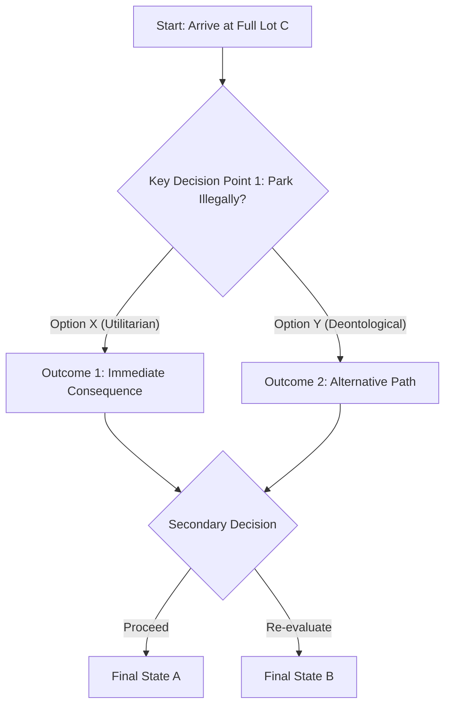

# Resilient Activity Redesigns (Drafts)

**Target:** PHIL-101 Introduction to Ethics
**Strategy:** Transition from unverified text to process-oriented, locally grounded multimodal deliverables.

---

## Redesign 1: Live Decision Tree Defense (Replaces: Weekly Discussion Post)

### Rationale

Discussion boards are often auto-generated by LLMs. This redesign shifts the focus to structural mapping and live justification (AI-as-CoPilot policy adherence).

### Instructions

1. Use an AI tool to help you map the core differences between Bentham and Kant regarding the morality of the **Midwestern University Lot C Parking Shortage**.
2. Go to [Mermaid Live Editor](https://mermaid.live). Copy and paste the baseline decision tree provided below into the editor.
3. **Your Task:** Modify the decision tree. Add at least three new branching decision points representing different student stakeholders attempting to park in Lot C. Apply Kantian logic to one branch and Utilitarian logic to another.
4. **Deliverable:** Submit a 3-minute screen recording (via Loom or Canvas Studio) where you walk through your modified decision tree, explaining *why* you structured the outcomes the way you did based on the assigned readings.

### Supplied Baseline (Mermaid)

**Instructions for Student Modification:**

1. Replace placeholder text with specific concepts from your reading.
2. Add at least two new decision nodes demonstrating edge-cases.
3. Apply style classes to differentiate ethical vs. technical decisions.

---

## Redesign 2: Hyper-Local Policy Evaluation (Replaces: Final Research Paper)

### Rationale

A 10-page paper on "Technology and Privacy" is infinitely automatable. This redesign forces students to evaluate the ethics of an actual, hyper-local policy using their lived experience on campus (Freire-Hooks Relational Index).

### Instructions

1. We are looking at the ethics of mass data collection. Review the recent proposal (provided in this week's module) to install automated license plate readers in all Midwestern University parking lots to address the Lot C shortage.
2. Form a group of three. Conduct a 10-minute structured dialogue with your group members regarding how this proposal impacts non-traditional or working adult learners (who make up 40% of our demographic).
3. **Deliverable:** You are not writing an essay. You are submitting an **Architectural Decision Record (ADR)** addressed to the Campus Security Committee. It must follow the strict 1-page ADR formatting constraints provided in the syllabus. It must explicitly cite arguments made by your specific group members during your dialogue, and it must include an appendix showing exactly what prompts you used if you queried an AI to help structure your ADR (per the Level 2 AI-as-CoPilot policy).

---
